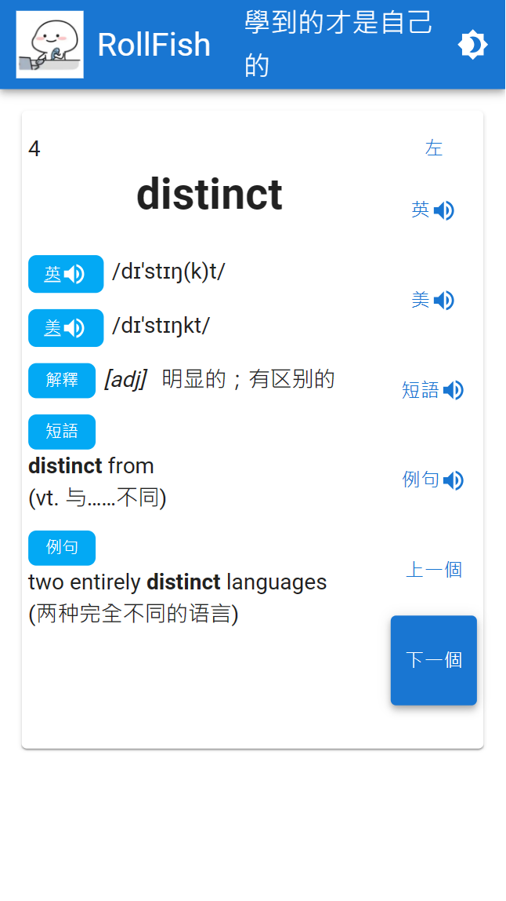

  

# RollFish

#### 這是一個利用摸魚時間背單字的軟件

#### 可以讓你在上班、上課等惡劣環境下安全隱蔽地背單字

由於 ToastFish 只支持 Win10+系統且只有本地程序，為了讓更多人能夠持續學習進步，我開發了這個 WEB 版。當前僅支持學英語。

如果你的設備 PWA 支持良好，建議安裝到本地使用。

Tips: 數據來自於 [ToastFish](https://github.com/Uahh/ToastFish)

---

## Features

- 可通過 PWA 安裝
- 支持白天黑夜主題
- 學習數量設置
- 學習成果檢測
- New:左邊發音為 https://dict.youdao.com, 右邊發音為 Web Speech API
- New:按鈕可選擇左持或右持

---

## Developers

In the project directory, you can run:

### `yarn start`

Runs the app in the development mode.\
Open [http://localhost:3000](http://localhost:3000) to view it in your browser.

The page will reload when you make changes.\
You may also see any lint errors in the console.

### `yarn build`

Builds the app for production to the `build` folder.\
It correctly bundles React in production mode and optimizes the build for the best performance.

The build is minified and the filenames include the hashes.\
Your app is ready to be deployed!

See the section about [deployment](https://facebook.github.io/create-react-app/docs/deployment) for more information.
